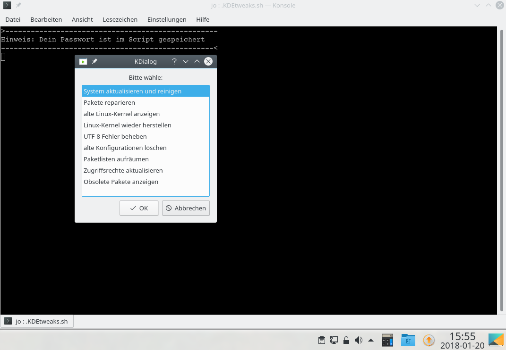
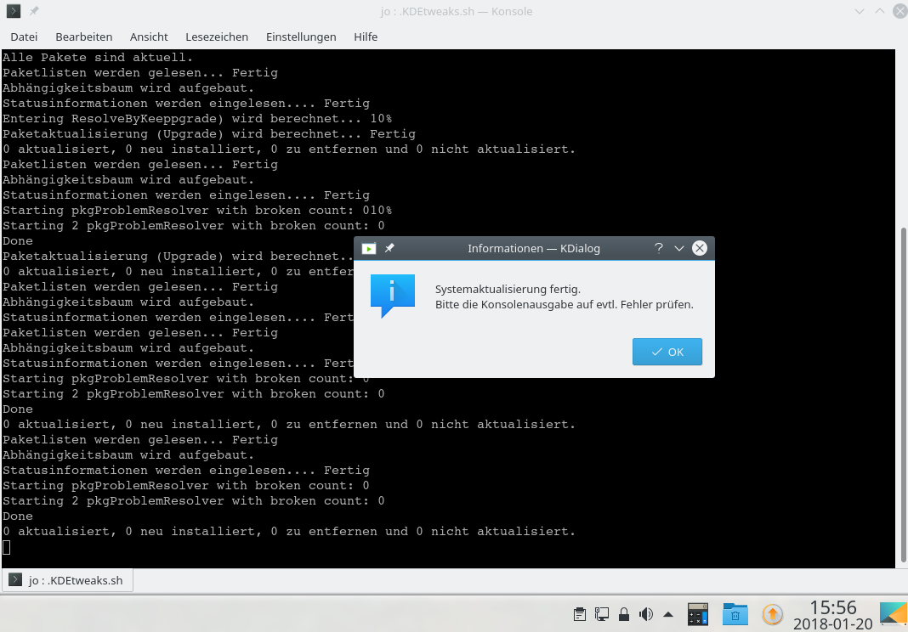

# KDEtweaks V18.02.028
### LINUX DEBIAN (UBUNTU, MINT, KDE neon usw) aktualisieren mit einem Klick uvw

Dieses Script benötigt kdialog: sudo apt install konsole kdebase-bin oxygen-icon-theme

Ein Klick und ohne Abfrage das komplette LINUX-System aktualisieren, reinigen, alte Kernel löschen oder reparieren
Dieses Script lässt sich gut als Miniprogramm in die Fensterleiste einfügen und kann ohne Passwortabfrage gestartet werden.

Zur besseren Überwachung was abläuft, sollte alles immer in der Konsole (Termnial) laufen wie im Script beschrieben (konsole -e ~/.KDEtweaks.sh).
Alles ohne Gewähr! Macht Backups!

Mit dieser Shell-Script könnt ihr per Menü:

    1) System aktualisieren und reinigen
    2) Pakete reparieren
    3) alte Linux-Kernel anzeigen
    4) Linux-Kernel wieder herstellen
    5) UTF-8 Fehler beheben
    6) alte Konfigurationen löschen
    7) Paketlisten aufräumen
    8) Zugriffsrechte/Besitzer aktualisieren
    9) Obsolete Pakete anzeigen

Hinweis zu Punkt 1/2/3/9:
Diese Punkte können immer gefahrlos ausgeführt werden

   - neueinlesen der Paketlisten und installierte Pakete wenn möglich auf verbesserte Version aktualisieren und alte entfernen
   - leeren des Paketcaches und Pakete die nicht mehr in den Quellen verfügbar sind löschen
   - alle alten Kernel bis auf die beiden neuesten Kernel entfernen
   - bei evtl. Problemen kann mit Punkt 2 eine Neukonfiguration der Pakete gestartet werden

Hinweis zu Punkt 4:

   - Punkt 1 entfernt alte Kernel bis auf die beiden neuesten Kernel
   - ab Ubuntu 16.04.2 oder 18.04.2 gibt es Rolling HWE Stacks und muss - wenn verwendet - im Script aktiviert werden!
   - Quelle: https://wiki.ubuntu.com/Kernel/LTSEnablementStack

Hinweis zu Punkt 5:

   - wer Kernels updatet, bekommt dabei häufig die Fehlermeldung: No support for locale: de_DE.utf8
   - das ist kein wirkliches Problem (nervig - aber harmlos) und wird hiermit behoben - kann ein paar Minuten dauern...

Hinweis zu Punkt 6:
Hier können zurückgebliebene Konfigurationen gelöscht werden - hatte damit noch nie ein Problem - dennoch Vorsicht!

   - deinstalliert man Pakete nicht vollständig, werden die Konfigurationsdateien nicht entfernt
   - diese können z.B. mit Synaptic in der Status Anzeige "Nicht installiert (zurückgebliebene Konfiguration)" gelöscht werden
   - per Konsole listet ihr Pakete mit 'rc' (remove-candidate) so: dpkg -l | grep ^rc | awk '{print $2}' (diese werden hier mit dem Menüpunkt 6 gelöscht)

Hinweis zu Punkt 7:

   - im Laufe der Zeit sammelt sich in /var/lib/apt/lists/ eine Menge an Listen an und nicht alle davon werden benötigt
   - mit dem Entfernen und das Neuladen dieser Listen lässt sich manchmal einiges an Speicherplatz einsparen

Hinweis zu Punkt 8:
Benutzte man für eine grafische Anwendungen sudo anstatt kdesudo (gksudo) kann das zu Rechte-Probleme führen.
Merke: Für Anwendungen mit einer GUI, nie sudo benutzen! Beheben könnt ihr das mit diesem Punkt, beachtet aber folgendes:

   - alle Dateien im home Ordner werden dem Home User zugeschrieben, dabei werden auch alle *.sh, und *.desktop Dateien ausführbar gemacht (chmod 0754)
   - wenn vorhanden werden die Zugriffsrechte des Ordners ~/public_html auch angepasst (siehe Apache Modul mod_userdir)

Hinweis zu Punkt 9:
Jedes Debian Paket durchläuft verschiedene Zweige innerhalb der Distribution von Experimental bis Stable. So kann es vorkommen das ein Paket nicht mehr durch den Upstream-Entwickler weiterentwickelt wird oder nicht mehr innerhalb von Debian betreut wird. Genauso gut kann ein Paket aus wichtigen Gründen umbenannt worden sein.
Zurück bleiben irgendwann nur noch obsolete Pakete, die keine Sicherheitsaktualisierungen mehr erhalten und im schlimmsten Fall nutzlos auf der Festplatte verkümmern. Nicht immer möchte man alle als obsolet eingestuften Pakete löschen.
Wenn man Pakete von Drittanbietern installiert hat, also manuell wie z.B. Skype (*.deb), würden diese mit purge ebenfalls entfernt. Damit so was nicht passiert, geht das übersichtlich mit der grafischen Synaptic Paketverwaltung in der Sektion "Installiert (lokal oder veraltet)".

Achtung: Script Variablen richtig setzten!

   - Variable "passwort" kann leer bleiben, dann werdet ihr bei jedem Aufruf nach dem Passwort gefragt
   - Das Passwort sollte nur gespeichert werden wenn euer Homeverzeichnis verschlüsselt ist
   - Flatpak ist eine Alternative zu Canonical snap Apps - Flatpak Updates kann mit "flatpak=1" aktiviert werden
   - Variable "kernel" muss richtig gesetzt sein - seit Ubuntu 16.04.2 wird Rolling HWE Stacks benutzt

---

